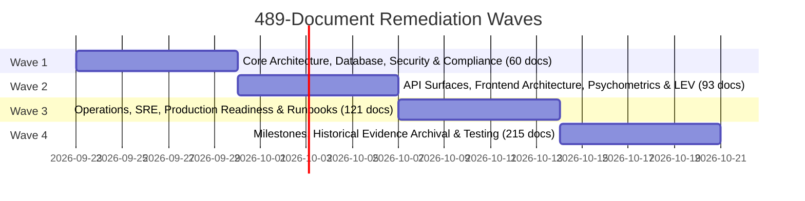

# Stale Documentation Phased Review Plan (489 Documents)

## Executive Summary

An audit of the EduBoost V2 repository conducted on **2026-09-22** identified that out of 597 total documentation files, **489 documents** are currently review-overdue according to their declared `last_reviewed` dates and `review_interval_days` policies.

The full catalog of affected files is recorded in [`docs/documentation/stale_documentation_review_register.md`](file:///home/nkgolol/Dev/Development/Eduboost-V2/docs/documentation/stale_documentation_review_register.md).

This document establishes a **rigorous, multi-wave operational execution plan** to audit, update, re-align, or archive all 489 overdue documents. In accordance with the project's **Anti-Theatre Governance Directive**, blanket resetting of review dates without active code inspection and technical verification is strictly forbidden.

---

## 1. Governance Principles & Anti-Theatre Rules

> [!IMPORTANT]
> **MANDATORY ANTI-THEATRE DIRECTIVE**
> 1. **No Cosmetic Date Resets**: Bumping `last_reviewed` without inspecting active code anchors and executing `evidence_command` is a direct violation of project governance.
> 2. **Code Truth > Stale Documentation**: When code and documentation diverge, active integration tests, Alembic migrations, and runtime entry points represent absolute truth. Documentation must be brought to code truth, never the reverse.
> 3. **Archival is Valid Remediation**: Historical point-in-time evidence bundles (e.g. `CORE_TECHNICAL_AUDIT_2026-05-17.md`, closed milestone signoffs) must not be forced into a perpetual review cycle. Transitioning them to `status: archived` with `review_interval_days: null` permanently resolves their debt while preserving the audit trail.

---

## 2. Document Triage & Remediation Dispositions

Every document in the 489-file backlog must be triaged into one of four deterministic dispositions:

| Disposition | Criteria | Required Action | Post-Action Status |
|---|---|---|---|
| **A. Re-verify & Renew** | Active document whose code anchors and descriptions match active code. | Execute `evidence_command`. Validate anchors. Bump `last_reviewed` to current date. | `status: active` |
| **B. Update & Re-align** | Active document that has drifted from current runtime (e.g. Render vs ACA, `/api/v2` routing, schema changes). | Rewrite drifted sections to match active implementation. Verify with tests. Bump `last_reviewed`. | `status: active` |
| **C. Archive & Retain** | Point-in-time audit, completed cluster closure, beta milestone evidence, or static historical decision record. | Set `status: archived`. Set `review_interval_days: null` (or remove interval). Add `archived_at` and `superseded_by` if applicable. | `status: archived` |
| **D. Deprecate & Consolidate** | Redundant, superseded, or fragmented document whose content has been folded into a canonical document. | Mark `status: deprecated`. Reference canonical file in `superseded_by`. Schedule for deletion or historical archive. | `status: deprecated` |

---

## 3. Breakdown of Overdue Documents by Domain

As cataloged in the baseline review register, the 489 overdue files span 8 operational domains:

```
Total Overdue Documents: 489
├── Domain 1: Core Architecture & System Blueprints (18 docs, up to +31d stale)
├── Domain 2: Frontend & Client Architecture (70 docs, up to +31d stale)
├── Domain 3: API & Route Inventory (8 docs, up to +61d stale)
├── Domain 4: Research, Psychometrics & LEV (15 docs, up to +30d stale)
├── Domain 5: Database & Migration Architecture (12 docs, up to +30d stale)
├── Domain 6: Release, Operations & Production Readiness (41 docs, up to +68d stale)
├── Testing & Quality Verification (28 docs, up to +69d stale)
└── General Documentation & Runbooks (297 docs, up to +68d stale)
```

---

## 4. Four-Wave Remediation Execution Schedule

To manage technical load and ensure thorough review, remediation is partitioned into four sequential weekly waves based on architectural risk and runtime impact.



---

### Wave 1: Core Architecture, Database, Security & Compliance
**Timeline:** Week 1 (Days 1–7)  
**Target Scope:** 60 Documents  
**Lead Owner:** Software Architect & Security Lead  

#### Scope
1. **Domain 1: Core Architecture & System Blueprints (18 docs)**
   - `docs/architecture/ARCHITECTURE.md`
   - `docs/architecture/architecture_decisions.md`
   - `docs/architecture/boundary_enforcement_policy.md`
   - `docs/architecture/import_boundaries.md`
   - `docs/architecture/service_boundary_classification_policy.md`
   - `docs/adr/ADR-036-knowledge-graph-learning-state-core.md`
   - Point-in-time architecture audits (transition to `archived`).
2. **Domain 5: Database & Migration Architecture (12 docs)**
   - Database schemas, replication topologies, migration contracts, Alembic drift policies.
3. **Security, Governance & Compliance (30 docs from General)**
   - POPIA compliance contracts, DSR cascade documentation, security audit baselines, cryptographic token signing policies.

#### Verification & Exit Criteria
- AST boundary checks (`.importlinter`) pass.
- Alembic models match DB schema (`alembic check` zero drift).
- POPIA erasure cascade tests pass (`tests/test_popia_negative.py`).
- All 60 documents updated, archived, or verified with evidence.

---

### Wave 2: API Surfaces, Frontend Architecture, Psychometrics & LEV
**Timeline:** Week 2 (Days 8–14)  
**Target Scope:** 93 Documents  
**Lead Owner:** Backend Lead, Frontend Lead & Psychometrics Lead  

#### Scope
1. **Domain 3: API & Route Inventory (8 docs)**
   - `docs/api_versioning_policy.md` (affirm `/api/v2` canonical routing).
   - `docs/route_inventory.md` (verify exact 234 endpoint count).
   - OpenAPI contract specifications.
2. **Domain 2: Frontend & Client Architecture (70 docs)**
   - Next.js application contracts, component specifications, state management blueprints, Tailwind/design system documentation, PWA service worker contracts.
3. **Domain 4: Research, Psychometrics & LEV (15 docs)**
   - Longitudinal Empirical Validation (LEV) framework, IRT item selection contracts, mastery bounds (`MAX_CONFIDENCE_THRESHOLD`), CAPS alignment mapping.

#### Verification & Exit Criteria
- `make openapi-check` passes.
- Frontend E2E smoke tests (`tests/e2e`) pass against Next.js webpack build.
- Psychometrics unit tests (`tests/unit/test_irt*.py`) pass with mathematical caps verified.
- All 93 documents updated, archived, or verified with evidence.

---

### Wave 3: Operations, SRE, Production Readiness & Runbooks
**Timeline:** Week 3 (Days 15–21)  
**Target Scope:** 121 Documents  
**Lead Owner:** DevOps & SRE Lead  

#### Scope
1. **Domain 6: Release, Operations & Production Readiness (41 docs)**
   - Render deployment runbooks (`render.yaml` canonical configuration).
   - Health check specifications (`/health`, `/ready`, `/api/v2/health/deep`).
   - Logging, metrics, and Prometheus scrape contracts.
2. **Operations & SRE Runbooks (80 docs from General)**
   - Database backup/restore procedures (`docs/operations/database_backup_contract.md`).
   - Disaster recovery drill procedures.
   - Alertmanager and incident triage playbooks.
   - Git packfile remediation procedure (`docs/operations/git_history_packfile_remediation_runbook.md`).

#### Verification & Exit Criteria
- Render health endpoints respond with HTTP 200.
- Database backup/restore commands verified in local container drill.
- Metrics endpoints emit valid Prometheus metrics format.
- All 121 documents updated, archived, or verified with evidence.

---

### Wave 4: Milestones, Historical Evidence Archival & Testing
**Timeline:** Week 4 (Days 22–28)  
**Target Scope:** 215 Documents  
**Lead Owner:** Release Manager & QA Lead  

#### Scope
1. **Testing & Quality Verification (28 docs)**
   - Test strategy documents, unit/integration testing contracts, Playwright E2E frameworks, CI pipeline definitions.
2. **Historical Milestone & Beta Release Ledgers (~187 docs from General)**
   - Cluster D/E/H closure ledgers (`docs/operations/CLUSTER_*_CLOSURE.md`).
   - Release candidate evidence sweeps (`release_candidate_evidence_sweep_*.md`).
   - Beta acceptance exit criteria, final signoff manifests, reviewer disposition records.
   - *Primary Action for Historical Artifacts:* Systematic conversion to `status: archived` with `review_interval_days: null` and link to final release tag.

#### Verification & Exit Criteria
- All historical release ledgers cleanly classified as `archived` with zero active review intervals.
- Active testing documentation verified against `pytest.ini` and `playwright.config.ts`.
- `make docs-housekeeping-check` reports **0 overdue documents** across the entire repository.

---

## 5. Review Protocol for Document Auditors

For every document under review, the assigned auditor must complete this checklist before submitting a review PR:

```markdown
### Document Review Checklist: [docs/path/to/doc.md]

- [ ] 1. Read the full document and identify all `code_anchors`.
- [ ] 2. Inspect active code referenced in anchors. Do filenames, functions, classes, and configurations exist and match?
- [ ] 3. Run the document's `evidence_command` locally and capture the exit code.
- [ ] 4. Determine disposition:
      [ ] A. Re-verify & Renew: Content accurate; bump last_reviewed.
      [ ] B. Update & Re-align: Rewrite out-of-date sections to match code; bump last_reviewed.
      [ ] C. Archive: Historical artifact; change status to archived, set review_interval_days to null.
      [ ] D. Deprecate: Superceded by another document; set status to deprecated and point to canonical.
- [ ] 5. Run `git diff` to verify only intended changes are present.
- [ ] 6. Attach test output/command summary to the Pull Request.
```

---

## 6. Accountability & Governance Tracking

| Role | Assigned Domain | Responsibilities |
|---|---|---|
| **Software Architect** | Domains 1 & 4 | Architectural boundaries, import contracts, psychometric bounds. |
| **Backend Lead** | Domain 3 & Database | API routing, OpenAPI schema, Alembic migrations. |
| **Frontend Lead** | Domain 2 | Next.js architecture, state models, UI component contracts. |
| **DevOps / SRE Lead** | Domain 6 & Operations | Render deployment configs, backup runbooks, monitoring. |
| **Security / Compliance Officer** | Compliance & POPIA | DSR cascades, PII sanitization, consent state machines. |
| **Release Manager** | Wave 4 Archival | Archival classification of milestone ledgers and release notes. |

### Tracking Progress
Progress will be tracked by updating [`docs/documentation/stale_documentation_review_register.md`](file:///home/nkgolol/Dev/Development/Eduboost-V2/docs/documentation/stale_documentation_review_register.md) at the conclusion of each weekly wave.
The CI check `make docs-housekeeping-check` serves as the automated ratchet preventing newly overdue documents from entering the repository.
