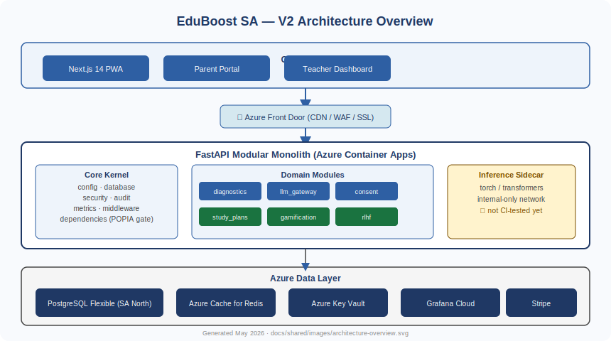

# 🦁 EduBoost SA

**AI-powered adaptive learning for South African learners, Grade R–7.**

EduBoost SA is a POPIA-compliant, CAPS-aligned adaptive learning platform
combining IRT-based diagnostics with LLM-generated lessons localised to
South African cultural contexts.



---

## Tech Stack

| Layer | Technology |
|---|---|
| Backend | FastAPI · Python 3.11 · SQLAlchemy 2.0 async |
| Frontend | Next.js 14 (App Router) · TypeScript |
| Database | PostgreSQL 14+ (Azure SA North) |
| Cache / Queue | Redis · arq |
| AI / LLM | Groq (Llama 3) · Anthropic Claude |
| Infrastructure | Azure Container Apps · Bicep IaC |
| Observability | Grafana Cloud (Prometheus + Loki) |

---

## Quick Start

```bash
git clone https://github.com/NkgoloL/Eduboost-V2.git
cd Eduboost-V2
cp .env.example .env          # fill in your keys
docker compose -f docker-compose.v2.yml up --build
```

See [Getting Started](docs/site/docs/getting-started.md) for the full guide.

---

## Documentation

EduBoost SA maintains two complementary documentation systems:

### Sphinx — Backend API Reference

Auto-generated from Python docstrings using `sphinx.ext.autodoc`.
Covers every public class, function, and module in the backend.

```bash
# Install dependencies
pip install -r docs/api/requirements.txt

# Build HTML
cd docs/api
make html

# Open the generated site
open docs/api/build/html/index.html

# Live-reload server (requires sphinx-autobuild)
make livehtml
```

Output: `docs/api/build/html/`

### MkDocs — Developer Guides

Narrative documentation covering installation, architecture, deployment,
and contributor workflow. Uses the Material for MkDocs theme.

```bash
# Install dependencies
pip install mkdocs-material

# Build static site
cd docs/site
mkdocs build

# Live-reload dev server
mkdocs serve

# Open the dev server
open http://127.0.0.1:8000
```

Output: `docs/site/site/`

### Documentation Structure

```
docs/
├── api/                        # Sphinx — backend API reference
│   ├── Makefile                # make html | make livehtml | make clean
│   ├── requirements.txt        # sphinx, sphinx-rtd-theme, ...
│   └── source/
│       ├── conf.py             # Sphinx config (autodoc, napoleon, viewcode)
│       ├── index.rst           # Master table of contents
│       ├── api/
│       │   ├── core.rst        # app.core.* (config, security, audit)
│       │   ├── modules.rst     # app.modules.* (diagnostics, lessons, ...)
│       │   ├── routers.rst     # app.api_v2_routers.*
│       │   ├── models.rst      # app.models.*
│       │   └── repositories.rst
│       └── notes/
│           ├── changelog.rst
│           └── todo.rst
├── site/                       # MkDocs — developer guides
│   ├── mkdocs.yml              # MkDocs config (Material theme, nav)
│   └── docs/
│       ├── index.md            # Platform overview
│       ├── getting-started.md  # Installation & local setup
│       ├── architecture.md     # System design & module map
│       ├── deployment.md       # Docker, Azure, CI/CD
│       └── contributing.md     # Dev workflow, docstring style, PR checklist
└── shared/
    └── images/
        └── architecture-overview.svg   # Shared diagram (used by both systems)
```

### Adding Docstrings

All backend modules use **Google-style** docstrings so Sphinx autodoc
generates complete API docs automatically:

```python
def my_function(param: str) -> bool:
    """One-line summary.

    Args:
        param: Description of the parameter.

    Returns:
        bool: Description of the return value.

    Raises:
        ValueError: When param is empty.

    Example:
        ::

            result = my_function("hello")
            assert result is True
    """
```

Every new public class, method, or module must have a docstring before
merging — enforced in the [PR checklist](docs/site/docs/contributing.md#pr-checklist).

---

## Project Structure

```
app/
├── api_v2.py                   # FastAPI entrypoint
├── api_v2_routers/             # HTTP routing layer
├── core/                       # Shared kernel (config, security, audit, ...)
├── modules/                    # Domain bounded contexts
│   ├── diagnostics/            # IRT 2PL engine
│   ├── lessons/                # LLM gateway (Groq + Anthropic)
│   ├── consent/                # POPIA consent lifecycle
│   ├── learners/               # Archetype profiling
│   ├── study_plans/
│   ├── gamification/
│   ├── parent_portal/
│   └── rlhf/                   # Reinforcement learning from human feedback
├── repositories/               # Generic async data-access layer
└── models/                     # SQLAlchemy ORM (Alembic-managed)
```

---

## Running Tests

```bash
# All tests
pytest

# With coverage (target: ≥ 80%)
pytest --cov=app --cov-report=term-missing

# POPIA compliance suite
pytest tests/popia/

# IRT engine unit tests
pytest tests/unit/modules/diagnostics/
```

---

## License

MIT — see [LICENSE](LICENSE).
